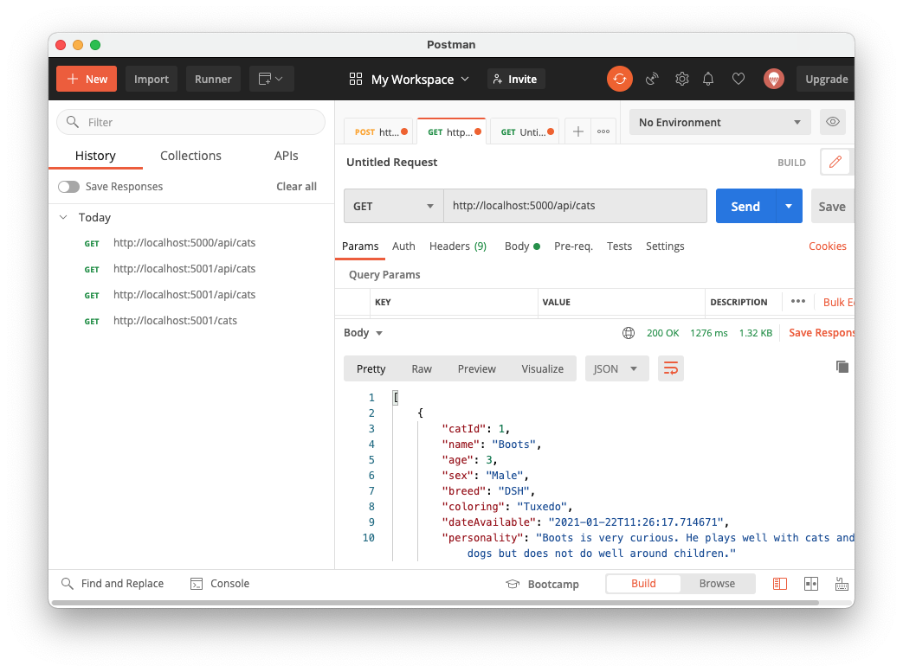
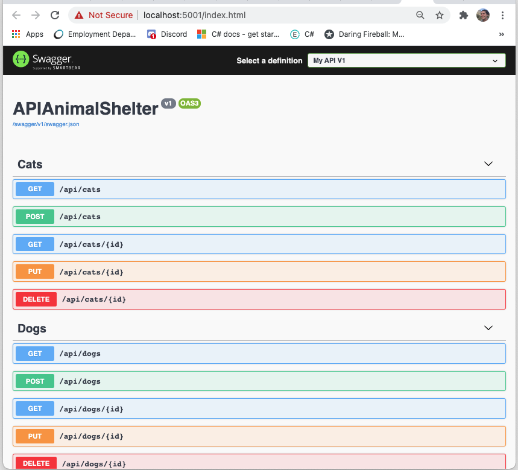

# Animal Shelter API

### Independent project for Epicodus building out an API, 1.22.2021

#### By Bess Campbell

## Description

You've completed a few projects at the dev agency where you work and you've been given more autonomy to choose which project you'd like to work on next. The agency currently has three new back-end contracts to build APIs for their clients. Since this is the first time you've been given free rein on a project, take this opportunity to showcase your versatility for the project manager.

Building an API
For your final C#/.NET code review, you’ll build one of the three APIs below:

--> * Animal Shelter: Create an API for a local animal shelter. The API will list the available cats and dogs at the shelter.
* Local Business Lookup: Create an API for a local business lookup. The API will list restaurants and shops in town.
* Parks Lookup: Create an API for state and national parks. The API will list state and national parks.

You have the freedom to build out your APIs as you wish. At the very least, your API should include the following:

* Full CRUD functionality.
* Further exploration of one of the following objectives: authentication, versioning, pagination, Swagger documentation, or CORS.
* Complete documentation of API endpoints and the further exploration you did.

## Prerequisites

### Software Requirements

• A browser like [Chrome](https://www.google.com/chrome/)

• A code editor like [VSCode](https://code.visualstudio.com/download)

• With [.NET Core 2.2](https://dotnet.microsoft.com/download/dotnet-core/thank-you/sdk-2.2.106-macos-x64-installer) installed

• [MySQL](https://dev.mysql.com/downloads/file/?id=484914) **Instructions for setup below**

• [MySQL Workbench](https://dev.mysql.com/downloads/file/?id=484391) **Instructions for setup below**

• [Postman](https://www.postman.com/downloads/)(optional)

#### MySQL & MySQL Workbench Setup instructions

* Download the [MySQL Community Server](https://dev.mysql.com/downloads/file/?id=484914). Click the 'No thanks, just start my download' link.
* Follow along with the installer until you reach the Configuration page. Then select the following options:
  * Use Legacy Password Encryption.
  * Set password to **epicodus** or to your own personlized password.
  * Click Finish.

* Open the terminal and enter the command `echo 'export PATH="/usr/local/mysql//bin:$PATH"'>>~/.bash_profile`
* Type `source ~/.bash_profile` in the terminal to verify that MySQL was installed.
* Enter `mysql -uroot -pepicodus` or `mysql -uroot -p{your_password}` in the terminal to verify the installation. You will know it's installed when you gain access to the `mysql>` command line.
* Download the [MySQL Workbench](https://dev.mysql.com/downloads/file/?id=484391) file using the 'No thanks, just start my download' link.
* Install MySQL Workbench in the Applications folder.
* Open MySQL Workbench and select the `Local instance 3306` server. You will need to enter the password **epicodus** (or the password you set). 

#### Setup and Use (cloning)

 * Open your terminal and ensure you are within the directory you'd like the file to be created in.
 * Enter the following command `$ git clone https://github.com/besscampbell/AnimalShelter.git`
 * Once cloned, use the `$ cd AnimalShelter.Solution/APIAnimalShelter` command to navigate to the project directory.
 * Enter `$ dotnet restore`

#### Import database with Entity Framework Core
* Now enter `$ dotnet ef database update` to create database in MySQL.
* To run the console application, enter `$ dotnet run`
* Your command line will open a server (likely `http://localhost:5000/`). Navigate to this URL in your browser to view the project.

#### Import Database with MySQL Workbench
* In the top toolbar of MySQL Workbench, click on `Server -> Data Import`.
* Select option for `Import from Self-Contained File`.
* Set the `Default Target Schema` or create a new schema.
* Select Schema Objects you wish to import.
* Ensure the option `Dump Structure and Data` is selected (located near the bottom).
* Click `Start Import`

#### Launch the API
* Navigate to `$ cd AnimalShelter.Solution/APIAnimalShelter`
* Run the `$ dotnet run` command to access CRUD capabilities of the API in Postman or in the browser using Swagger.
* When you are finished accessing the API  you can clost your live server by pressing `control` and `C`.

## API Documentation

Search through the endpoints of the Animal Shelter API using Postman or in your browser using your local host. It will most likely look something like this: `http://localhost:5000`

### Endpoints

 Base URL: `http://localhost:5000`

 #### HTTP Request Structure for Cats
 ```
 GET /api/cats
 POST /api/cats
 GET /api/cats/{id}
 PUT /api/cats/{id}
 DELETE /api/cats/{id}
 GET /api/cats/random
 ```
 #### Sample JSON Response for Cats
 ```
    {
      "catId": 3,
      "name": "Agatha Christie",
      "age": 13,
      "sex": "Female",
      "breed": "Persian",
      "coloring": "Grey",
      "dateAvailable": "2021-01-22T11:26:17.744366",
      "personality": "Agatha is a senior cat looking for her furrever lap. She loves snuggles and head pets"
    }
```
 #### HTTP Request Structure for Dogs
 ```
 GET /api/dogs
 POST /api/dogs
 GET /api/dogs/{id}
 PUT /api/dogs/{id}
 DELETE /api/dogs/{id}
 GET /api/dogs/random
 ```
 #### Sample JSON Response for Dogs
 ```
  {
    "dogId": 4,
    "name": "Zeus",
    "age": 2,
    "sex": "Male",
    "breed": "Rottweiler",
    "coloring": "Black, Tan",
    "dateAvailable": "2021-01-22T11:26:17.745422",
    "personality": "Zeus had a growth mindset and loves to learn. He needs positive outlets for his energy and a calm environment."
  }
```
### Accessing the API using Postman



#### GET --> /api/cats  --> /api/dogs  

 With your live server running open the Postman app and type `http://localhost:5000/api/cats` or `http://localhost:5000/api/dogs` into the the URI line and choose `GET` from the CRUD functionalities drop down box and hit send. A response will appear in the body below. This will return a list of all the cats or dogs. 

#### POST --> /api/cats  --> /api/dogs

 To input a new cat or dog you will need to submit all of the information about the cat/dog in key/value pairs in JSON. I find the easiest to do this is to copy one of the examples retrieved from the get and replacing the information as the keys will not change, only the values or you can copy the example below. To input the information for the cat/dog you will need to select the `Body` tab three to the right of the `Params` tab under the URL. Select `raw` and then `JSON` from the dropdowns and then enter the cat/dog info(no need to enter an ID):
 ```
  {
        "name": "Agatha",
        "age": 13,
        "sex": "Female",
        "breed": "Persian",
        "coloring": "Grey",
        "dateAvailable": "2021-01-22T11:26:17.744366",
        "personality": "Agatha is a senior cat looking for her furrever lap. She loves snuggles and head pets"
    }
```
#### GET --> /api/cats/{id}  --> /api/dogs/{id}

 To get specific information about an animal append the CatId or the DogId to the end of the URL like this:  `http://localhost:5000/api/cats/3`, select `GET` from the CRUD drop down and hit send. This will return the Cat with the CatId = 3.

#### PUT --> /api/cats/{id}  --> /api/dogs/{id}

 To update information about an existing cat or dog you will need to submit all of the information for the cat/dog through the `Body` tab three to the right of the `Params` tab under the URL. Select `raw` and then `JSON` from the dropdowns and then enter the updated information along with all other info:
 ``` 
  {
        "catId": 3,
        "name": "Agatha Christie",
        "age": 13,
        "sex": "Female",
        "breed": "Persian",
        "coloring": "Grey",
        "dateAvailable": "2021-01-22T11:26:17.744366",
        "personality": "Agatha is a senior cat looking for her furrever lap. She loves snuggles and head pets"
    }
```
 Select `PUT` from the CRUD drop down list, enter `http://localhost:5000/api/cats/3`(the last number will change depending on the id of the animal you wish to update) into the URL and press send. To double check that the cat/dog was updated send a `GET` request.

#### DELETE --> /api/cats/{id}  --> /api/dogs/{id}
 
 What do you know this animal has been adopted and no longer needs to be in the Animal Shelter's database. Type `http://localhost:5000/api/cats/3`(or the id of whichever animal you wish to delete), select `DELETE` from the CRUD drop down and hit send. To double check that the cat/dog was updated send a `GET` request. 

#### GET --> /api/cats/random --> /api/dogs/random

 Want to feature a pet of the day but worried about favoritism? Allow this API to do the work for you

### Accessing the API using Swagger



 Did you read through the Postman examples and think that sounded a little exhausting? Well you are in luck! Swagger allows you do navigate through the CRUD functions of the Animal Shelter API through a very accesible browser interface. Here is all you have to do, while you have a live server running, open the `http://localhost:5000/` in your browser and then click on the CRUD function you would like to implement hit `Try it out!` and then `Execute` entering the CatID/DogId when necessary. Enjoy! 

#### Swagger Resources
 [Swashbuckle and ASP.NET Core](https://docs.microsoft.com/en-us/aspnet/core/tutorials/getting-started-with-swashbuckle?view=aspnetcore-5.0&tabs=visual-studio)

 [GitHub Swashbuckle](https://github.com/domaindrivendev/Swashbuckle.AspNetCore/blob/master/README.md)

## Technologies Used

_This application required use of the following programs/languages/libraries to create:_
* _GitBash_
* _Visual Studio Code_
* _GitHub_
* _C# v 7.3_
* _.NET Core v 2.2_
* _ASP.NET Core MVC_
* _Bootstrap_
* _CSS_
* _cshtml_
* _MySQL_
* _MySQL Workbench_
* _Entity Framework Core_
* _Postman_
* _Swagger_
* _Swashbuckler_

## Known Bugs

No known bugs.

## Support and contact details

Feel free to contact <bess.k.campbell@gmail.com>

## License

_MIT_ Copyright (c) 2020 *_Bess Campbell_*